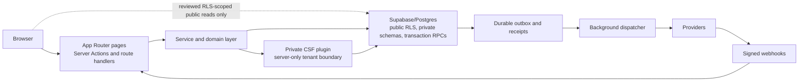

# Platform architecture

Let's Assist has three layers: the public Next.js platform, Supabase as the authoritative data and authorization layer, and organization-specific plugins loaded through a strict private boundary.

## End-to-end trust and data flow

The browser is untrusted. There is no browser path to private schemas or the private CSF implementation; reviewed public reads remain subject to RLS.

## Request and UI layer

`app/` uses the Next.js App Router. Server Actions and route handlers are externally reachable code and must establish the user, organization, capability, and resource scope before invoking a service or transaction. `proxy.ts` refreshes Supabase sessions; it is not an authorization substitute.

Shared presentation belongs in `components/`. Route modules should assemble a page from bounded components and services rather than becoming domain implementations.

## Responsibility by boundary

| Boundary                                                 | Required responsibility                                                                                                                                                                                                                                                                                                                                              |
| -------------------------------------------------------- | -------------------------------------------------------------------------------------------------------------------------------------------------------------------------------------------------------------------------------------------------------------------------------------------------------------------------------------------------------------------- |
| App Router, Server Actions, route handlers, and webhooks | Establish authentication; verify webhook signatures; parse and validate untrusted input; resolve current organization, capability, and resource authorization; require a bounded idempotency key for retryable writes; map failures without exposing internals.                                                                                                      |
| Service and domain layer                                 | Accept explicit actor and tenant context; re-check domain invariants; keep every query, command, provider call, and idempotency key organization-bound; classify retryable, terminal, and ambiguous outcomes.                                                                                                                                                        |
| Supabase/Postgres                                        | Enforce RLS for browser-reachable data and deny browser roles private-schema access; preserve tenant foreign keys and constraints; use transaction RPCs to revalidate authority under lock and atomically write state, audit events, outbox entries, and receipts. Privileged clients never make upstream authorization optional.                                    |
| Dispatchers and providers                                | Claim bounded batches with leases, retry with backoff and attempt limits, and deduplicate by durable receipt. A timeout after dispatch is ambiguous until reconciled; it is not proof that the provider did nothing.                                                                                                                                                 |
| Logging, observability, and caches                       | Emit correlation, tenant, operation, attempt, latency, and bounded error-code fields, but redact secrets, credentials, source rows, provider payloads, and student/member data. Never place tenant-private or user-private results in a public/shared cache; bypass caching or key it by every authorization dimension and invalidate it after consequential writes. |

## Service layer

`services/` and focused `lib/` modules own reusable domain behavior, provider integrations, validation, and error mapping. Services accept explicit authorization context and avoid importing browser-only code.

## Persistence layer

Supabase/Postgres is authoritative. RLS protects ordinary public-schema access. Plugin-owned records live in `plugin_data`, which is server-only and organization-scoped. Consequential multi-record changes use reviewed database transactions/RPCs and immutable audit events.

## Scheduled work

GitHub Actions schedules authenticated `app/api/cron/**` routes. Each route validates its dedicated token, honors its worker-enabled flag, and must be safe to retry. Workers claim durable work rather than treating process memory or a provider response as the source of truth. Local and CI acceptance force dispatch off unless a test explicitly supplies a fake dispatcher.

## Related documents

- [Plugin boundaries](plugins.md)
- [Data boundaries](data.md)
- [Environment model](../development/environments.md)
